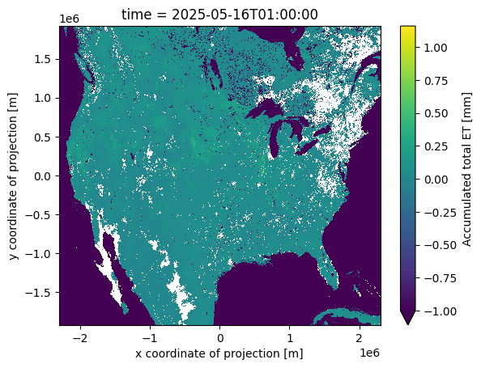

# nwm_batcher
A repo to pull data from the national water model s3 bucket using Virtualizarr

This tool's goal is to dynamically pull batches of data from the operational NWM to be used for analysis.

  

## Getting started
1. Install a python env `uv venv`
2. Install the nwm_batcher package through `uv pip install -e .` from the project root
